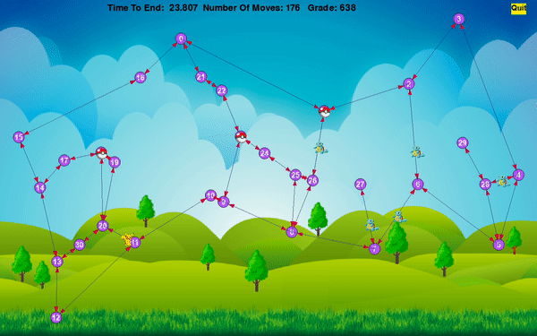

# PokemonGame
The Fifth Task in OOP course. Building A Pokémon game 

* **Note: inorder to run our program the user must have the pygame library.**

<!-- TABLE OF CONTENTS -->

  
Content

  <ol>
    <li><a href="#about-the-project">About The Project</a></li>
    <li><a href="#about-the-project">Plan and design of The Project</a></li>
    <li><a href="#Gui">GUI & "How To Run"</a></li>
    <li><a href="#the-algorithm">The Algorithm</a></li>
    <li><a href="#results">Results</a></li>
    <li><a href="#UML">Uml</a></li>
    <li><a href="#languages-and-tools">Languages and Tools</a></li>
    <li><a href="#acknowledgements">Acknowledgements</a></li>
    <li><a href="#contact">Contact</a></li>
  </ol>

<!-- ABOUT THE PROJECT -->
## About The Project

#### Task 5 Object-Oriented Programming

***Authors : Shauli Taragin & Ido Bar***  

In this project we implemented algorithms for developing a pokemon game on a directed weighted graph.

We also created an enhanced Graphical User Interface to visualize any given game stage.

---------

## Plan and design of The Project

Upon planning are project we would like to focus on 3 fields for which we wish to plan elaborately before we begin implementing code.

The first and most important matter for us in this project is to communicate with the server only when we know the agent is on a pokemon or a node , 
and not just randomly moving. 

All of our planning will go towards this goal . That is we shall meticulously plan our algorithms to work with multi threads correspondingly inorder to achieve ultimate results with minimum moves.
<li> Planning the main classes:</li>
Our GraphAlgo and DiGraph classes will hold the shortest path algorithm and supporting functions.

1. We will have our dijkstra algorithm class and the MinHeap class to implement the shortest path efficiently.
2. We will also have a Node class which implements A basic node class.
3. We shall implement Edge class, GeoLocation class, Agent class, and Pokemon class.
4. We find the need to create an "Arena" class that will contain the other classes and help us hold all the information elegantly. This way we will have a "module" class which we can work with very comfortably
5. There will be a class that will act as our "main class" and control the game. This class will communicate to all our project via the arena class.
6. And of course for the sake of good order we will have a "Gui class" named window which will show the live changes occurring in the game.
 

***By the MVC design pattern principles the USER uses the Play_game class. He uses that class in order to control the modules and functions 
inside the Arena class. The class is also used by the Window to allow the user to kindly view the changes in the game itself***

<li> Planning the method of implementation:</li>
We will create a dictionary that every key is the Node Id and the value is the Node Object.
Every NodeData will contain two dicts :1. A dict of the out edges that the current node is their source, the key will be the Id of the destination node and the value will be the Edge object.
2. A dict of the in Edges that the current node is their destination the key is the src and the value is weight of the edge.
The key will be the Id of the source node and the value will be the edge object.
<li> Planning the dijkstra algorithm:</li>
We wanted to implement the dijkstra algorithm in the most elegant ,most efficient way possible. Obviously the dijkstra algorithm is needed for calculating the center, shortest path, and tsp methods.
So we will achieve this by creating an instance of a MinHeapDijkstra. e.g Instead of implementing dijkstra with a priority queue we will apply the min heap data structure which we will create on the dijkstra algorithm.
<li>Planning the Play_game class:</li>
The play_game class holds the functions that our algorithms are using.
It shall initialize the client and iterate continually until the game is over.
It also paints the graph , agents and pokemons every iteration.
<li>Planning the Arena class:</li>
The arena class will hold every object we have: edge, agent, graph, client, pokemon.
It will help the play game by making it easier to get all the information it needs to run the game as elegantly as possible.
The arena will get the information from the Play_game and it will update it.

---------

| *A short video clip of Our gui representation of the pokemon game case 11* |

## GUI

### Please visit our wiki page for A short video and more

##### We will explain about our gui as well as give a short and easy manual of how the user can use it easily

*About our GUI* :
* Firstly in is imported to state that the gui runs with a certain "tick" which is not so pleasent. But the reason for this is that we are planning our moves meticulously using multi threading.
* In our display of the pokemon game the user must run the client from the terminal choosing which case to play. Then running the program through the play_game class

The game is represented in the following manner :
* The agents are marked as pokaballs e.g they catch pokemons.
* Pokemons of type positive are marked as Picachu (the yellow pokemon).
* Pokemons of type negative are marked as squirtl (the blue pokemon).
* The time remaining , our current grade and moves are written on the top of the screen clearly in black.
* *If the user wishes to exit the game he has a yellow quit button on the top right.*

* Nodes are represented by purple circles. Each node's key is written above it in white.

* Edges are represented by black lines with a red arrow at the end showing the direction of the edge.

* Inorder to run a gui performance for a game of their choice, the user must work from the play_game class.

The user can either create a graph by adding nodes and edges e.g. check0 or load a graph of their choice which is located in the data package.

Either way the gui implementation is called from the interface function plot_graph

| *Our gui representation of the pokemon game case 3* |

---------

## The Algorithm
***We will lay out our Pokemon Game algorithms and explain how we implemented them:***

###Arena class

**The Arena class holds:**
* *pokemons_lst -*  The list that contains the pokemons.
* *agents_lst -* The list that contains the agents.
* *graph_algo -* The graph algo class.
* *info_dict -* The dictionary that holds the information of the game.
* *dijkstra_list -* A Dictionary that holds all the nodes in the graph as keys and the value for each node is a list with the shortest weight of the
path between this node to every other node in the graph. 
* *client -* the client of the game.
 
**The Arena class functions:**
1. *init -* Initializes the arena class from the info we got from the client.
2. *update_pokemons_lst -* Updates the arena.pokemon_lst with the given json from the client.
3. *update_agent_lst -* Updates the agents values every iteration from the client.get_agents
4. *place_agents_at_beginning -* Creates the agents and places them at the nodes that are closest to the pokemons.
5. *update_game_info -* Updates the game info from the client.

 

### Play_game class

*The Play_game which is our main class holds as class memebers:*
* *moves -* counts the moves made.
* *grade -* sums the grade of the game.

*The Play_game class functions:*
1. *AllocateAgent -* allocates an agent to a given pokemon.
2. *get_all_permutations -* receives a list and returns all the permutations of that list.
3. *calculate_time_of_path -* using the dijkstra dictionary to calculate the weight of the path.
4. *dist_between_points -* receives two points and returns the distance between two points.
5. *thread_function -* The thread that sleeps and activates the move method from the client with a certain sleep time.
It is responsible for the movement of the nodes, and eating the pokemons.
6. *run_game -* runs the game.

## THE MAIN ALGORITHM

Firstly we would like to initiate the client and connect it to the server. After connecting the client we place the agents
in the graph near the edges with the most pokemons on them.

After starting the client , upon every iteration we update the list of pokemons that are still in the graph and are waiting
to be eaten. After that we update the agents values such as position, value, speed etc.
Then we sent the pokemons in the graph to the our main algorithm. That is to the allocate_agent function thus allocating each pokemon to 
a certain agent.

Then we permute all the pokemons in the path and calculate the weight of the permutation by using the 
dijkstra dictionary that we created in the arena class at the beginning of the game.
After finding the permutation with the minimal weight we use the shortest path function from the GraphAlgo class inorder to find
the path the agent should take between the pokemons according to the most efficient permutation.

Once we allocated every pokemon, we iterate over the agents and choose the next edge for every agent according to the ultimate path we found.

Now, inside that iteration we can calculate the time when the agent will arrive to his destination, and create a thread that is used to wait
the amount of time that it will take the agent to arrive to the next node.Once the thread is done waiting the thread will call the clients
move function. In order to correctly call it at the exact time the agent arrives.

At last we iterate over the pokemons that were allocated to the agent. We calculate the time the agent will arrive at that
pokemon and we will create another thread that sleeps the amount of time it will take the agent to arrive catch the pokemon. When the thread finishes its sleep
it will call the move method from the client. This is In order to call the move only when we are close to the pokemon and successfully eat it.
Then we again clear the pokemon list and get the updated list from the client, we update our agent data and continue to the next iteration.

---------
<!-- results -->

## Results

#### For our enhanced explanation please visit our wiki page for this project.

These are our best Results.

|Case|Grade|Moves|
|---------|---------|---------|
|0|44|125|
|1|167|455|
|2|55|207|
|3|213|770|
|4|63|253|
|5|189|662|
|6|28|79|
|7|136|337|
|8|33|58|
|9|167|451|
|10|29|59|
|11|424|1513|
|12|25|40|
|13|112|236|
|14|59|173|
|15|146|349|

---------

## UML

| Our Unified Modeling Language representation |

*Note*: We have subtracted all the graph and graph algo classes for which the implementation is identical to Ex3.
You may find that full uml [Here](https://github.com/ShauliTaragin/OOP_Ex3#uml)

---------

## Languages and Tools

  

<code></code>
<code></code>
 <code></code>
<code></code>
<code></code>
<code></code>
<code></code>
  

<!-- ACKNOWLEDGEMENTS -->
## Acknowledgements
* [Python](https://www.python.org/)
* [UML](https://en.wikipedia.org/wiki/Unified_Modeling_Language)
* [Git](https://git-scm.com/)
* [Jupyter](https://jupyter.org/)
* [Pygame](https://www.pygame.org/)
* [Git-scm](https://git-scm.com/book/en/v2/Getting-Started-Installing-Git)

<!-- CONTACT -->
## Contact

[Ido](https://github.com/idobar1403/)

[Shauli](https://github.com/ShauliTaragin/)

[The Project](https://github.com/ShauliTaragin/PokemonGame)
