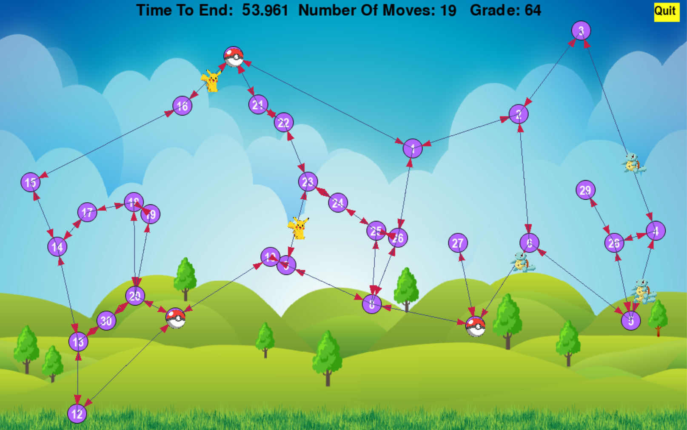

# PokemonGame
The Fifth Task in OOP course. Building A Pokémon game 

* **Note: inorder to run our program the user must have the pygame library.**

<!-- TABLE OF CONTENTS -->

  
Content

  <ol>
    <li><a href="#about-the-project">About The Project</a></li>
    <li><a href="#about-the-project">Plan and design of The Project</a></li>
    <li><a href="#Gui">GUI & "How To Run"</a></li>
    <li><a href="#the-algorithm">The Algorithm</a></li>
    <li><a href="#results">Results</a></li>
    <li><a href="#UML">Uml</a></li>
    <li><a href="#languages-and-tools">Languages and Tools</a></li>
    <li><a href="#acknowledgements">Acknowledgements</a></li>
    <li><a href="#contact">Contact</a></li>
  </ol>

<!-- ABOUT THE PROJECT -->
## About The Project

#### Task 5 Object-Oriented Programming

***Authors : Shauli Taragin & Ido Bar***  

In this project we implemented algorithms for developing a pokemon game on a directed weighted graph.

We also created an enhanced Graphical User Interface to visualize any given game stage.

---------

## Plan and design of The Project

Upon planning are project we would like to focus on 3 fields for which we wish to plan elaborately before we begin implementing code.
<li> Planning the main classes:</li>
Our GraphAlgo and DiGraph classes will hold the shortest path algorithm and supporting functions.
We had our dijkstra algorithm class and the MinHeap class.
We will also had a Node class which implements A basic node class.
We implemented some classes to help our game to run better.
We implemented Edge class, GeoLocation class, Agent class, and Pokemon class.
We create Arena class that contain the other class and help us to reach every class from it.
The class that controlled the game was the Play_game class that used the arena functions to run the game.
The Window class is basically show the live changes occurrences in the game. 
 

**By the MVC design pattern principles the USER uses the Play_game class in order to control the modules and functions 
inside the Arena class that is used by the Window to show the user the changes in the game itself**

<li> Planning the method of implementation:</li>
We will create a dictionary that every key is the Node Id and the value is the Node Object.
Every NodeData will contain two dicts :1. A dict of the out edges that the current node is their source, the key will be the Id of the destination node and the value will be the Edge object.
2. A dict of the in Edges that the current node is their destination the key is the src and the value is weight of the edge.
The key will be the Id of the source node and the value will be the edge object.
<li> Planning the dijkstra algorithm:</li>
We wanted to implement the dijkstra algorithm in the most elegant ,most efficient way possible. Obviously the dijkstra algorithm is needed for calculating the center, shortest path, and tsp methods.
So we will achieve this by creating an instance of a MinHeapDijkstra. e.g Instead of implementing dijkstra with a priority queue we will apply the min heap data structure which we will create on the dijkstra algorithm.
<li>Planning the Play_game class:</li>
The play_game class holds the functions that our algorithm is using.
It initialize the client and iterating until the game is over.
It also painting the graph every iteration.
<li>Planning the Arena class:</li>
The arena class will hold every object we have: edge, agent, graph, client, pokemon.
It will help the play game by making it easier to get all the information it needs to run the game as clean as it can.
The arena will get the information from the Play_game and it will update it.

---------

| *Our gui representation of the pokemon game case 11* |

## GUI

### Please visit our wiki page for A short video and more

##### We will explain about our gui as well as give a short and easy manual of how the user can use it easily

*About our GUI* :

* In our display of the pokemon game the user must run the client from the terminal choosing which case to play. Then running the program through the play_game class

The game is represented in the following manner :
* The agents are marked as pokaballs e.g they catch pokemons.
* Pokemons of type positive are marked as Picachu (the yellow pokemon).
* Pokemons of type negative are marked as squirtl (the blue pokemon).
* The time remaining , our current grade and moves are written on the top of the screen clearly in black.
* *If the user wishes to exit the game he has a yellow quit button on the top right.*

* Nodes are represented by purple circles. Each node's key is written above it in white.

* Edges are represented by black lines with a red arrow at the end showing the direction of the edge.

* Inorder to run a gui performance for a game of their choice, the user must work from the play_game class.

The user can either create a graph by adding nodes and edges e.g. check0 or load a graph of their choice which is located in the data package.

Either way the gui implementation is called from the interface function plot_graph

| *Our gui representation of the pokemon game case 3* |

---------

## The Algorithm
***We will lay out our Pokemon Game algorithms and explain how we implemented them:***

###Arena class

**The Arena class holds:**
* *pokemons_lst -*  The list that contains the pokemons.
* *agents_lst -* The list of agents.
* *graph_algo -* The graph algo class.
* *info_dict -* The dict that has the info of the game.
* *dijkstra_list -* Dictionary that every key is the node id and the value is list with the shortest weight of the
path between this node to every other node. 
* *client -* the client of the game.
 
**The Arena class functions:**
1. *init -* Initialize the arena class from the info we got from the client.
2. *update_pokemons_lst -* Update the arena.pokemon_lst with the given json from the client.
3. *update_agent_lst -* Update the agents values from the client.get_agents
4. *place_agents_at_beginning -* Create the agents and place them at the nodes that has the most pokemons near them.
5. *update_game_info -* Update the game info from the client.

 

### Play_game class

*The Play_game holds:*
* *moves -* counts the moves the client made.
* *grade -* sums the grade of the game.

*The Play_game class functions:*
1. *AllocateAgent -* allocate agent to given pokemon.
2. *get_all_permutations -* give list and return all the permutations of the list.
3. *calculate_time_of_path -* using the dijkstra dictionary to calculate the weight of the path.
4. *dist_between_points -* given two points it return the dist between the two points.
5. *thread_function -* the thread that sleeps and activate the move method from the client.
It is responsible for the movement of the nodes, and eating the pokemons.
6. *run_game -* runs the game.

## THE MAIN ALGORITHM

First we wanted to initiate the client and connect it to the server, after connecting the client we place the agents
in the graph near the most visited edges. 
After starting the client we update at every iteration of the game the pokemons that in the graph and waiting
to be eaten, then we updated the agents values such as position, value, speed etc.
Then we sent the pokemons in the graph to the allocate_agent function and allocate each pokemon to 
certain agent. 
Then we permute all the pokemons in the path and calculate the weight of the permutation by using the 
dijkstra dictionary that we created in the arena class at the beginning of the game.
After finding the permutation with the min weight we used the shortest path function from the GraphAlgo class and found
the path between the pokemons in the best permutation. 
After allocating every pokemon, we iterate over the agents and choose the next edge for every agent by the path we found.
 
Then we calculate the time when the agent will arrive to his destination, and then created thread that is used to wait
the time that it will take the agent to arrive to the next node and after finish waiting the thread will call the client.
move, in order to correctly call it at the time the agent arrives. 
Then we iterate over the pokemons that were allocated to the agent we calculated the time the agent will arrive the
pokemon and we will create another thread that sleeps the time it will take to arrive the pokemon and then it will call
the move method from the client, in order to call the move close to the pokemon and successfully eat the pokemon.
Then we again clear the pokemon list and get them from the client, and updated the agent data.
---------
<!-- results -->

## Results

#### For our enhanced explanation please visit our wiki page for this project.

These are our best Results. 
:

|Case|Grade|Moves|
|---------|---------|---------|
|0|10 ms|160 ms|
|1|10 ms|160 ms|
|2|10 ms|160 ms|
|3|10 ms|160 ms|
|4|10 ms|160 ms|
|5|10 ms|160 ms|
|6|10 ms|160 ms|
|7|10 ms|160 ms|
|8|10 ms|160 ms|
|9|10 ms|160 ms|
|10|10 ms|160 ms|
|11|1513|424|
|12|10 ms|160 ms|
|13|10 ms|160 ms|
|14|10 ms|160 ms|
|15|10 ms|160 ms|

---------

## UML

| Our Unified Modeling Language representation |

*Note*: We have subtracted all the graph and graph algo classes for which the implementation is identical to Ex3.
You may find that full uml [Here](https://github.com/ShauliTaragin/OOP_Ex3#uml)

---------

## Languages and Tools

  

<code></code>
<code></code>
 <code></code>
<code></code>
<code></code>
<code></code>
<code></code>
  

<!-- ACKNOWLEDGEMENTS -->
## Acknowledgements
* [Python](https://www.python.org/)
* [UML](https://en.wikipedia.org/wiki/Unified_Modeling_Language)
* [Git](https://git-scm.com/)
* [Jupyter](https://jupyter.org/)
* [Pygame](https://www.pygame.org/)
* [Git-scm](https://git-scm.com/book/en/v2/Getting-Started-Installing-Git)

<!-- CONTACT -->
## Contact

[Ido](https://github.com/idobar1403/)

[Shauli](https://github.com/ShauliTaragin/)

[The Project](https://github.com/ShauliTaragin/PokemonGame)
